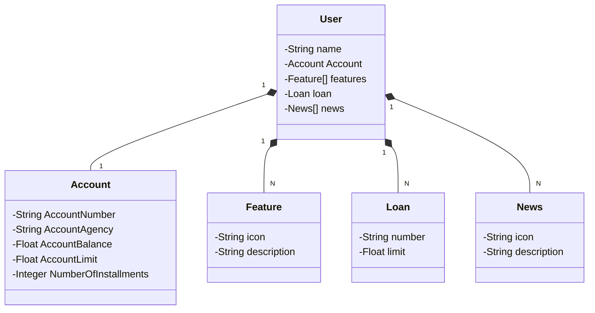

#Sistema de controle de empréstimos.

##Diagrama de classes

```mermaid
classDiagram
    class User {
        -String name
        -Account Account
        -Feature[] features
        -Loan loan
        -News[] news
    }
    class Account {
        -String AccountNumber
        -String AccountAgency
        -Float AccountBalance
        -Float AccountLimit
        -Integer NumberOfInstallments
    }
    class Feature {
        -String icon
        -String description
    }
    class Loan {
        -String number
        -Float limit
    }
    class News {
        -String icon
        -String description
    }

    User "1" *-- "1" Account
    User "1" *-- "N" Feature
    User "1" *-- "N" Loan
    User "1" *-- "N" News
```
